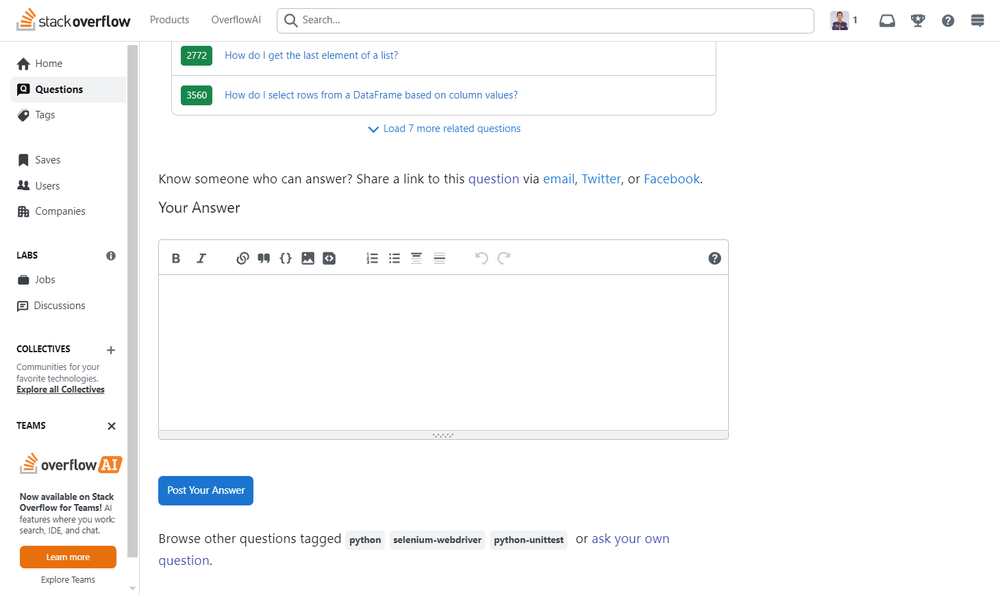

# Tugas Review Software
## Tool, Tutor, Tutee

**Stack Overflow** merupakan platform tanya jawab berbasis komunitas yang digunakan oleh pengembang IT seperti Programmer, Pengembang perangkat lunak, teknisi jaringan, data saintis dan lainnya.

### Sebagai Tutor
Stack Overflow dapat berfungsi sebagai tutor karena menyediakan berbagai jawaban dari para pakar dan kumunitas global untuk berbagai pertanyaan yang dihadapi oleh pengembang. Caranya adalah setiap pengguna mengajukan pertanyaan, maka pengguna yang lebih ahli dapat menjawab, memberi solusi, serta penjelasan secara mendalam. Software ini juga memiliki mekanisme voting pada jawaban, yang mana setiap pengguna yang terbantu dari jawaban tersebut dapat memberikan vote, membuat jawaban tersebut menjadi relevan dan naik ke jawaban paling atas. 

### Sebagai Alat
Stack Overflow sebagai alat untuk menemukan solusi dari permasalah yang dialami dalam penulisan kode. Selain itu stack overflow juga sebagai gudang dari berbagai jawaban yang diberikan oleh ahli, karena pertanyaan dan jawaban sebelumnya tersimpan dan dapat diakses kapan saja. Sehingga ini memudahkan pengembang dalam menyelesaikan masalah dalam kode nya secara langsung.

### Sebagai Murid
Pengguna Stack Overflow berperan sebagai murid yang belajar dari komunitas ini. Dengan mekanisme pengguna dapat mengajukan pertanyaan selayaknya murid lalu peran komunitas adalah sebagai guru yang akan menjawab pertanyaan itu. Selain itu para pengguna juga akan mengetahui apa yang belum mereka ketahui sebelumnya dengan memanfaatkan fitur diskusi. Stack overflow juga membantu mengasah kemamputan problem solving, critical thinking dengan menjawab pertanyaan dari pengguna lain dan membuat pertanyaan yang baik dan benar.

#### Tampilan halaman Stack Overflow

**Halaman Home**

Halaman tampilan saat masuk kedalam aplikasi, menampilkan top question atau pertanyaan teratas.

**Halaman Questions**

Halaman question adalah kumpulan pertanyaan dari pengguna.

**Halaman Tags**

Menampilkan tag pada setiap pertanyaan yang diberikan, seperti javascript, php, html dan css. Dan lainnya.

**Halaman Discussion**

Tempat untuk diskusi antara pengguna, saling berkolaborasi dan menyelesaikan permasalahan bersama.

**Halaman untuk membuat pertanyaan**

Pada halaman ini kita dapat mengajukan pertanyaan dengan isian yang telah ditentukan.

**Halaman untuk membuat pertanyaan**

Kita juga dapat menjawab pertanyaan dari pengguna dengan mengatur tampilan dari jawaban kita tersebut.

**Pertanyaan dari pengguna**

Disini kita dapat melihat pertanyaan dari pengguna, dapat dilihat pertanyaan tersebut telah disusun sedemikian rupa agar tertata dengan rapi. Dan pertanyaan tersebut telah ditanyakan 10 tahun lalu, menandakan pertanyaan dan jawaban tersebut masih relevan hingga kini.

**Jawaban dari pengguna lain**

Dibawah dari pertanyaan tersebut kita dapat melihat jawaban dari ahli, dapat dilihat jawaban tersebut memiliki 1050 vote yang berarti relevan dan dapat membantu pengguna lain. Jawaban tersebut juga memiliki tag Answer recomended by PHP Collective yang berarti itu direkomendasikan PHP Collective.

### Kesimpulan

**Stack Overflow** merupakan situs yang membantu para programmer, pengembang perangkat lunak, teknisi jaringan dan lainnya yang berkaitan dengan IT untuk menemukan jawaban dari permasalahan yang dialami, serta SO ini juga dapat mengasah kemampuan para expert dalam menjawab pertanyaan dari pengguna lainnya. Tentu aplikasi ini sangat bermanfaat bagi IT, karena mereka dapat secara efisien menemukan solusi. Sederhananya StackOferflow sebagai Tool adalah alat untuk mengajukan pertanyaan dan menjawab pertanyaan seputar kode dan lainnya, sebagai Tutor atau pengarah adalah dari jawaban yang diberikan dan mendapat solusi penyelesaian dari permasalahan tersebut, dan sebagai Tutee atau murid adalah SO memiliki fitur untuk mengajukan pertanyaan yang umumnya ditanyakan oleh seorang murid lalu dijawab oleh para ahli yang memiliki peran sebagai guru.